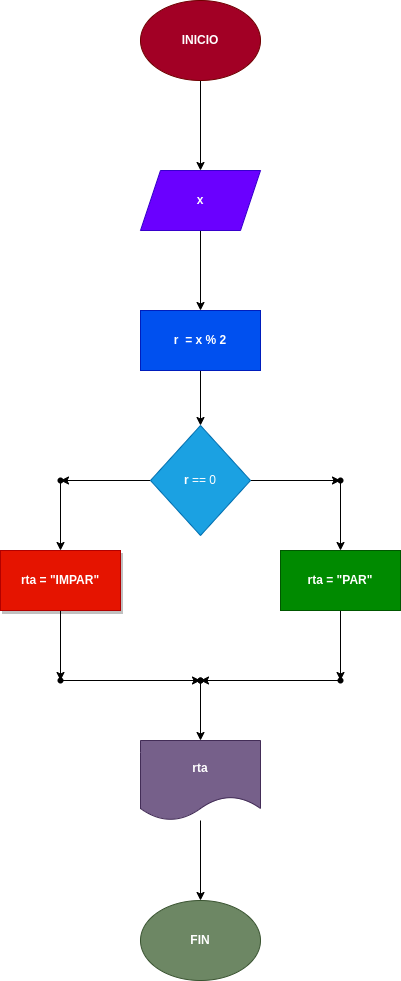

# Ejercicio N°4

## Poder diferenciar si un numero es par o es impar

---

# ANALISIS 

Variables de entrada(imput)

X: Un numero que puede ser par o puede ser impar

---

Variables de proceso y salida (processing,storage, output)

r = x % 2: sera lo que sacara el modulo del numero entre 2

r == 0: sera lo que utilisara para  calcular si el numero es par o impar

---
# DISEÑO

# CONSTRUCCION

